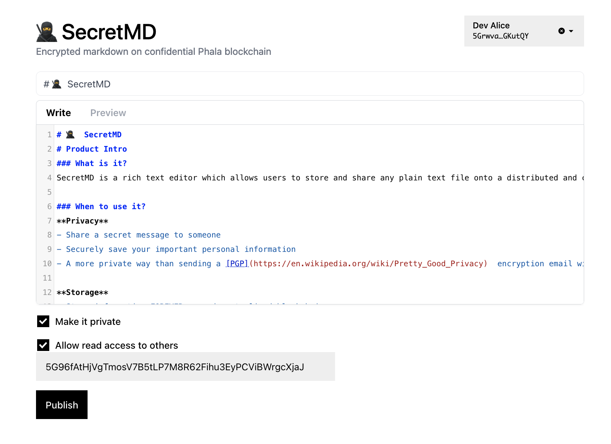

# 🥷  SecretMD

# Product Intro
### What is it?
SecretMD is a rich text editor which allows users to store and share any plain text file onto a distributed and confidential [Phala blockchain](https://phala.network/en/) in [Polkadot ecosystem](https://polkadot.network/).

### When to use it?
**Privacy**
- Share a secret message to someone
- Securely save your important personal information
- A more private way than sending a [PGP](https://en.wikipedia.org/wiki/Pretty_Good_Privacy)  encryption email without any need of email or PGP keys

**Storage**
- Store information FOREVER on a decentralized blockchain


### Why use it?
#### End to end encryption using Polkadot wallet
**No Extra Key Required** - Without any need of a separate set of encryption key like [PGP](https://en.wikipedia.org/wiki/Pretty_Good_Privacy), SecretMD requires only a Polkadot wallet for encryption/decryption. 

**No need for password** -Unlike [Pastebin.com](https://pastebin.com/), encryption does not require a password to encrypt or decrypt a file.

#### Decentralized storage #### 
Unlike [Pastebin.com](https://pastebin.com/) which stores the encrypted file on a centralized server which is susceptible for lost, SecretMD stores the file on Phala blockchain.

#### Hardware level End to End encryption
From Phala's [Intro to Confidential Contract](https://wiki.phala.network/en-us/docs/developer/#introduction-to-confidential-contract)
> By leveraging Trusted Execution Environment (TEE), which is powered by secure hardware, Phala supports confidential contracts, which are just like ordinary smart contracts but their input and states are encrypted and protected by hardware. 

## Development

### Technical Overview

### Development
Follow [Tutorial from Phala](https://wiki.phala.network/en-us/docs/developer/run-a-local-development-network/) to set up local development environment.

#### Client
##### Environment Variables

> **Note**: This step is **necessary** because backend services are required.

You can use environment variables to set prpc base url and ws provider endpoint:

```bash
cp .env .env.local
```

Then edit `.env.local`, for example:

```plain
NEXT_PUBLIC_BASE_URL=http://0.0.0.0:8001
NEXT_PUBLIC_WS_ENDPOINT=ws://0.0.0.0:19944
```

##### Getting Started

```bash
yarn
yarn dev
```
Open [http://localhost:3000](http://localhost:3000).

#### Server
It requires three different binaries to be executed in order.

From [Phala Blockchain in Detail](https://wiki.phala.network/en-us/docs/developer/blockchain-in-detail/)
> 
    phala-node: The Substrate-based blockchain node
    pRuntime: The TEE runtime. Contracts run in pRuntime
    pherry: The Substrate-TEE bridge relayer. Connects the blockchain and pRuntime


#####  Building and running Phala blockchain
Refer to [README_Phala](./README_Phala.md) for details.

If running on a VM, make sure to bind the 9944 WebSocket port.
```bash
vagrant ssh -- -L 9944:127.0.0.1:9944 -L 8000:127.0.0.1:8000
```

1. Run phala-node
```bash
./target/release/phala-node --dev --tmp
```
2. Run pRuntime
```bash
source /opt/intel/sgxsdk/environment
cd ./standalone/pruntime/bin
./app
```
3. Run pherry
```bash
./target/release/pherry --dev --no-wait
```

